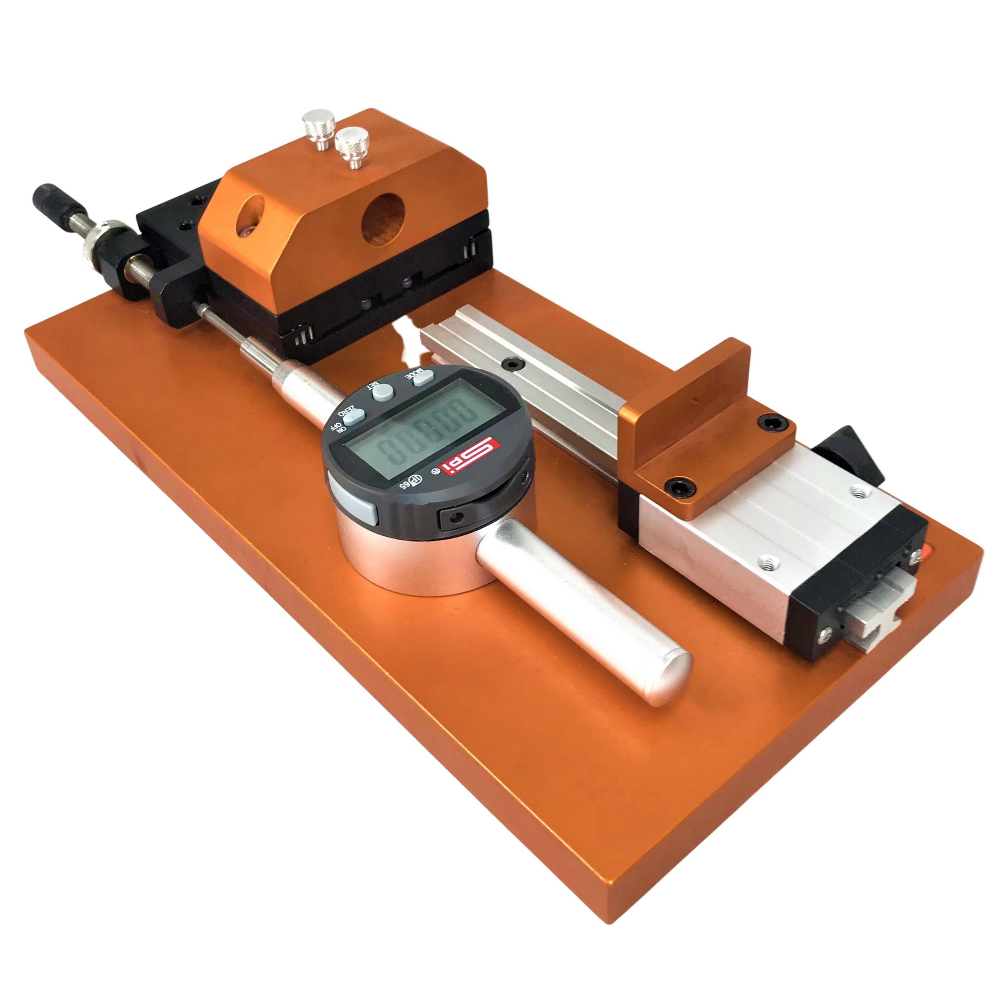
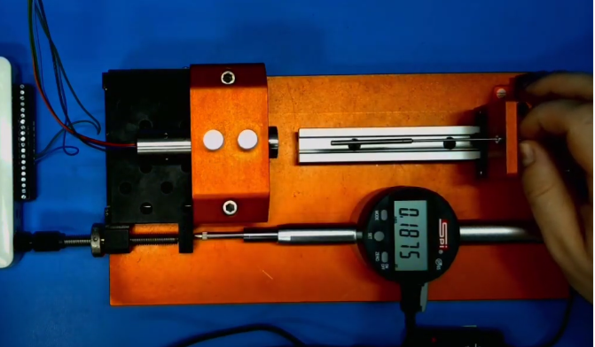
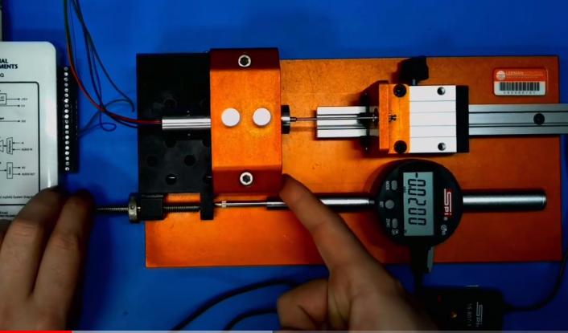
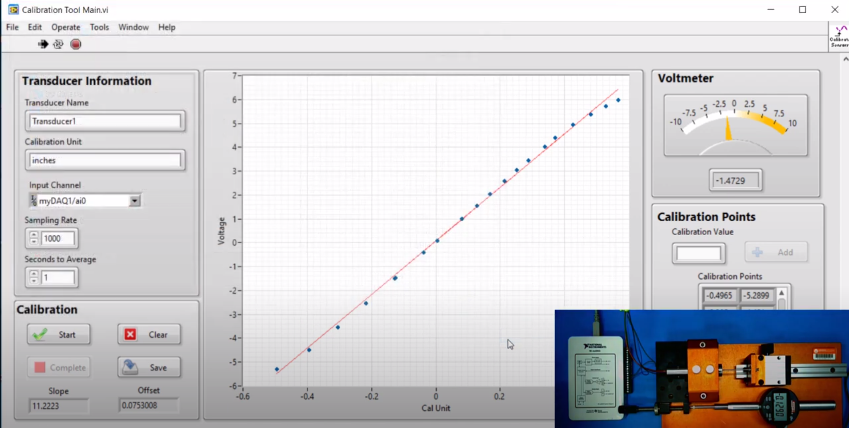

# Displacement Calibration Apparatus

{: style="height:300px"}

This documentation covers part number [10-0000027](https://leemangeophysical.com/product/displacement-transducer-calibration-system/).

## Overview
The displacement calibration rig makes it easy to accurately calibrate
lineartransducers with a total range of up to two inches. With proper setup it
allows for repeatable calibration in just a few minutes. The calibration
software automatically creates the calibration curve and a data file with every
calibration point.

## Setup
The displacement calibration rig is a sensitive instrument that requires
alignment after shipping and periodically before use. The tools required to
calibrate the device are included with the kit. A video of this process is
available at our website, and can be found
[HERE](https://www.youtube.com/watch?v=NtjN4-EOunA&feature=youtu.be) 

## Alignment Process
The alignment process of the displacement apparatus involves aligning the
digital indicator on the base to be exactly perpendicular to the stage. Without
correct alignment, calibration of the DCDTs will not be accurate due to cosine
error. Typically misalignment showing greater than 0.002” will need to be
corrected.   

**Tools Needed:**
* 0.5” and 1.0” Gauge Blocks
* 1.27mm Hex Key

1. Adjust the stage so that it is a small amount behind center using the
   adjustment screw, then zero the readout on the digital indicator.  

1. Gently pull back the quill and place the 0.5” gauge block as shown. Make sure
   the surfaces of the block are clean.
    

    {: style="height:300px"}
    

    
1. Note the measurement shown on the readout. In the image above the block is
   measuring at 0.501”, which is higher than its actual width.

1. Repeat steps 2 and 3 with the 1” gauge block. If the readings are different
   than expected alignment is necessary. Typically the alignment is acceptable
   if the error is roughly 0.001”, and alignment is necessary if it is greater
   than 0.005”.

1. For minor misalignments (<0.003”) often the quill at the top of the indicator
   can be tapped gently to realign it. If this doesn’t work further alignment is
   necessary. This can be accomplished by slightly loosening the screws on the
   bottom of the plate that hold the indicator with a hex key and gently
   rotating it. This is usually made easier by leaving one screw tight, and
   barely loosening the others.
    

    {: style="height:300px"}
    

* Checking alignment involves repeating steps 1-4 of the process each time the
alignment is changed. The goal of the alignment is to have each gauge block
measure as their calibrated length on the indicator. (0.5” block measures as
0.5000”, and 1.0” block as 1.0000”) but an error of ±0.002” is typically
acceptable.

* Once the correct alignment is achieved the screws can be tightened. After
tightening the screws, check the alignment again to make sure it hasn’t moved.

## DCDT Calibration
A video of this process is available on our website or
[HERE](https://www.youtube.com/watch?v=iZCyS38wjKE&feature=youtu.be)

1. Place the DCDT in the holder so that a small amount of the DCDT is protruding
   from the front. (This can vary depending on the model.) Then gently tighten
   the thumbscrews on top to hold it in place. 
    

    {: style="height:300px"}
    

1. Take the included core nuts and install them onto the DCDT core. The larger
   nut should be installed onto the core with the flange facing backwards. The
   core can then be put through the hole in the core plate on the slider. Screw
   on the second nut loosely so that the core can still move. 
    

    {: style="height:300px"}
    

1. Move the carriage so that the core slides into the DCDT. Once inserted the
   core nuts can be tightened. This ensures the core is properly aligned. 
    

    {: style="height:300px"}
    

1. Using the adjustment screw, move the stage so that it is centered on its base
   and the edges are flush. Zero the indicator by pressing the zero button. 
    

    {: style="height:300px"}
    

1. Apply power to the transducer and connect it to the computer via your data
   acquisition system.

1. Using the calibration software, name the transducer and specify the units it
   will be calibrated in. (The supplied unit displays in inches, so this will be
   the unit)
    

    {: style="height:300px"}
    

1. Select the input channel that the transducer is on by selecting browse in the
   input channel menu. 
    

    {: style="height:300px"}
    

1. Select the sampling rate of the system. If the system is capable of 10,0000
   samples/second this is best, but lower sampling rates will also work. Next,
   select the seconds to average. One second is typically acceptable, but in
   systems with significant noise higher averaging times may be beneficial.

1. Once all sampling parameters have been set, select start in the calibration
   menu. Move the transducer core on the carriage until the voltage displayed on
   the screen is close to zero (±100mv), then secure the carriage by tightening
   the knob on its side. This centers the core in the transducer.

1. Begin calibration by adjusting the stage until the indicator reads near one
   of the extremes of the transducer range. (For a 1” transducer this will be ±
   0.5”) This instrument is capable of calibrating transducers with a total
   range up to 2”.

1. To begin recording, keep the mouse cursor in the “Calibration Points” box on
   the screen and press the button on the cable connecting the indicator to the
   computer. This should cause a point to appear on the graph. 
    

    {: style="height:300px"}
    

    To complete the calibration curve, rotate the adjustment screw on the stage a
    couple of turns in the desired direction and press the button to record
    again.Repeat this process until the entire range of the transducer has been
    recorded. This will create the calibration curve.  Moving the same displacement
    with each measurement isn’t necessary because the displacement is precisely
    recorded by the digital indicator. Complete the calibration by repeating the
    process in reverse to fill out the plot. 
    

    {: style="height:300px"}
    

1. When the calibration curve is complete, select the complete button in the
   calibration menu, then click save and choose the save location of the file.
   You can then open the calibration file using notepad. This will display the
   parameters of the calibration, and the calibration points.
    

    {: style="height:300px"}
    
