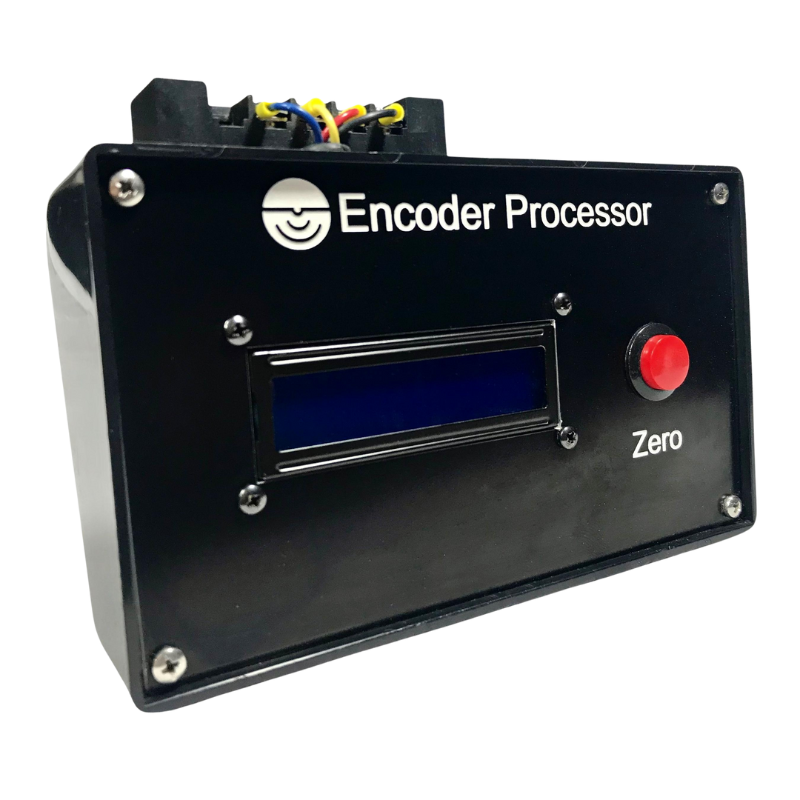

# Encoder Processor

{: style="height:300px"}

This documentation covers part number <a href="https://leemangeophysical.com/product/encoder-processor/" target="_blank" rel="noopener noreferrer">10-0000039</a>

## Overview
Thank you for purchasing the Leeman Geophysical LLC Encoder Processor. This unit
enables you to record the position of an encoder, calibrate that value to
engineering units, and receive that data at regular intervals or on a poll only
basis. This unit offloads the work of constantly monitoring encoders for pulses
and makes interfacing them to a host system trivial. This unit is decided to
work with any two-wire encoder that will operate with 5 VDC logic and power
supply signals. If your encoder has a “Z” terminal (positional terminal that
goes high once per revolution for absolute positioning work) it is still
compatible with this product, but the “Z” terminal will be unused. The encoder
processor is a relatively simple unit with only four connections to the encoder,
a USB connection, display, and zero button. The zero button will zero out the
readings from the encoder. All other functionality is controlled via the serial
interface

### Whats in the Box
Upon receipt of your unit, unpack the contents of the box and inspect all parts
for any damage incurred during shipping. Immediately report any missing parts or
damage to Leeman Geophysical for replacement.

* Encoder Processor Unit

## Hookup Guide
The encoder is connected to the processor through the terminal strips on the
back of the unit. This terminal strip contains power (+5VDC), ground, and
encoder A/B terminals. Refer to your encoder data sheet to determine where these
connections go for your encoder. The table below shows the wire connection
points on the back of the encoder. To connect your sensor, remove the protective
cover, loosen the screws opposite the connections coming from inside the box,
insert your encoder wiring, and tighten the screws. After installation is
complete, replace the protective cover by snapping it back onto the terminal
strip. Power can be supplied from a USB power adapter (not included) if the unit
will be used free standing or via the USB port of a connected computer if the
serial data/command interface will be used. For initial setup we recommend
connecting directly to a computer’s USB port to allow setup of the encoder and
calibration. After connecting your encoder and powering the system, turn the
encoder. You should see counts accumulate on the screen of the processor. If
nothing happens, turn off power to the unit and recheck all connections. See the
troubleshooting section if problems persist.

<table>
  <tr bgcolor="gray">
    <td><b>Position<b></td>
    <td><b>Color<b></td>
    <td><b>Description<b></td>
  </tr>

  <tr>
    <td>1</td>
    <td>Black</td>
    <td>GND</td>
  </tr>

  <tr>
    <td>2</td>
    <td>Red</td>
    <td>5V</td>
  </tr>

  <tr>
    <td>3</td>
    <td>Yellow</td>
    <td>Encoder A</td>
  </tr>

  <tr>
    <td>4</td>
    <td>Blue</td>
    <td>Encoder B</td>
  </tr>

</table>

## Serial Interface
The serial command set allows operation of every function of the unit, including
zeroing readings, modifying constants, and even setting display parameters.
Commands are all followed by a newline character. The valid commands are
outlined below as well as the procedure to connect to the unit with a serial
terminal program. If you plan to interface with the encoder processor from
LabView, Python, or another language, contact support for recommendations on
driver implementation.

### Connecting
Connect the encoder processor to a computer using the provided USB cable. You
will need to connect to the processor with a serial terminal application such as
CoolTerm, FreeTerm, etc. The default baud rate for the processor is 115200 baud.
Once the connection has been established, the processor will reboot. If you have
set the baud rate to another setting, it will persist through power cycles and
should be used for serial communication.

### Command Set
<table>
  <tr bgcolor="gray">
    <td><b>Command<b></td>
    <td><b>Description<b></td>
  </tr>

  <tr>
    <td>ZERO </td>
    <td>Zeroes the counts/position readouts - equivalent to pressing the zero button and holding it for more than one second.</td>
  </tr>

  <tr>
    <td>SETCAL XX.XX </td>
    <td>Sets the calibration in units per pulse. This number can be a floating point value.</td>
  </tr>

  <tr>
    <td>SETPUL XXX </td>
    <td>Sets the number of pulses per revolution of the encoder. This number must be an integer value.</td>
  </tr>

  <tr>
    <td>SETBAUD XXX </td>
    <td>Sets the baud rate that the unit uses to communicate with the host. The unit will restart the serial connection after this setting is modified. Valid baud rates are: 1200, 2400, 4800, 9600, 19200, 38400, 57600, 74880, 115200</td>
  </tr>

  <tr>
    <td>SETCONT XXX</td>
    <td>Sets the contrast of the LCD text. Must be an integer in the range 0-255.</td>
  </tr>

  <tr>
    <td>SETBRIGHT XXX</td>
    <td>Sets the brightness of the LCD backlight. Must be an integer in the range 0-255.</td>
  </tr>

  <tr>
    <td>SETMILLIS XXX </td>
    <td>Sets the number of milliseconds between sending encoder data back over the serial connection. Set to zero for polling only operation. Set in range 10-60000 milliseconds.</td>
  </tr>

  <tr>
    <td>GETPOS</td>
    <td>Displays the current encoder position in calibrated engineering units.</td>
  </tr>

  <tr>
    <td>GETCAL</td>
    <td>Displays the calibration factor set in units per pulse.</td>
  </tr>

  <tr>
    <td>GETCNT</td>
    <td>Displays the number of counts currently recorded from the encoder.</td>
  </tr>

  <tr>
    <td>GETPUL</td>
    <td>Displays the number of pulses per revolution of the encoder.</td>
  </tr>

  <tr>
    <td>GETMILLIS</td>
    <td>Displays the millisecond interval to send data packets back over serial.</td>
  </tr>

  <tr>
    <td>TIMED XXXX</td>
    <td>Sets the unit to output readings at XXXX milliseconds. Set to 0 for none.</td>
  </tr>

  <tr>
    <td>HELP</td>
    <td>Displays a help menu with a list of available commands.</td>
  </tr>

  <tr>
    <td>DEFAULTS</td>
    <td>Resets all stored values to the factory default values.</td>
  </tr>
</table>

## Setup
The encoder processor needs to know a few critical constants to produce accurate
and useful data. These values are the pulses per revolution of your encoder
(found in your encoder’s data sheet) and the calibration you wish to apply to
these data. To determine your calibration, you need to calculate what physical
unit (linear distance, degrees, or otherwise) you desire output in and how many
of those units there are in a single increment of the encoder. Connect to the
encoder processor as described in the serial interface section.

### Pulses Per Revolution
Find the data sheet for your encoder and determine how many pulses per
revolution it will produce. Common values are powers of two (2, 4, 8, 16, 32,
etc.). Once this number has been located, enter the serial command <code>SETPUL XXX</Code>
where <code>XXX</Code> is replaced by the number of pulses per revolution. All serial
commands are followed by a newline character (\n) to indicate the end of the
command. You can verify that the number of pulses per revolution was set
correctly by issuing the <code>GETPUL</Code> command and the setting is returned to the
serial terminal. This value is stored in the unit, even through power downs and
resets.

### Calibration
The calibration value is how the unit turns the pulses from the encoder into the
useful engineering units needed for your application. These can be any units
you’d like. The calibration value is multiplied by the number of pulses recorded
by the encoder to produce the engineering units value displayed. Similar to the
pulses per revolution setting, the calibration is set by issuing the command
<code>SETCAL XXX</Code> where <code>XXX</Code> is replaced by the calibration value you’d like to set.
This value can be a floating point number. The calibration can be verified by
issuing the <code>GETCAL</Code> command and the calibration will be returned to the serial
terminal. This value is stored in the unit, even through power downs and resets.  

When determining what units to use/display it is helpful to keep in mind the
floating point precision of the instrument. Calculations are carried to six
decimal places. Therefore a calibration factor of 0.0000005 units per pulse will
likely result in poor output or even no dimensional output. Likewise large
values such as 5783.3 units per pulse will quickly result in a very large number
which will eventually “roll over” to zero as the 32-bit signed output resets.
Therefore we recommend scaling your units to values in the order of magnitude
0.01-10, but your unique system may allow operation outside of these bounds.
Contact support if you have questions on your specific application.  

After setting your calibration, zero the readout by pressing and holding the
“Zero” button for more than one second. Turn your encoder and ensure that the
readings match the values you expect for your system.

### Example 1 - Angular Calibration
If you’d like to retrieve the angular displacement of a rotary encoder you’ll
need to calculate how many degrees are traveled by each pulse of the instrument
and set that as the calibration value. In this example (1) we will assume that
the encoder produces 256 pulses per revolution. The calibration factor would
then be:

$${360~degrees~per~rotation \over 256~pulses~per~revolution}=1.40625/count$$

### Example 2 - Linear Calibration
Assume the encoder is a wheel riding along a moving surface such as a conveyor
belt. If the wheel is 10 cm in diameter we can calculate the linear distance
traveled per rotation (2) and use that number to determine what distance is
covered per pulse(3). For this example we will assume an encoder with 8 pulses
per revolution.

$$10cm~diameter=31.41592cm~per~revolution$$  

$${31.41592cm~per~revolution \over 8~pulses~per~revolution} = 3.92699cm~per~pulse$$

## Revision History
<table>
  <tr bgcolor="gray">
    <td><b>Date</b></td>
    <td><b>Changes</b></td>
  </tr>

  <tr>
    <td>December 2020</td>
    <td>Initial Release</td>
  </tr>

  <tr>
    <td>March 2022</td>
    <td>Design Revisions and Reorganization</td>
  </tr>

  <tr>
    <td>May 2024</td>
    <td>Moved Documentation to MkDocs Format</td>
  </tr>
</table>
