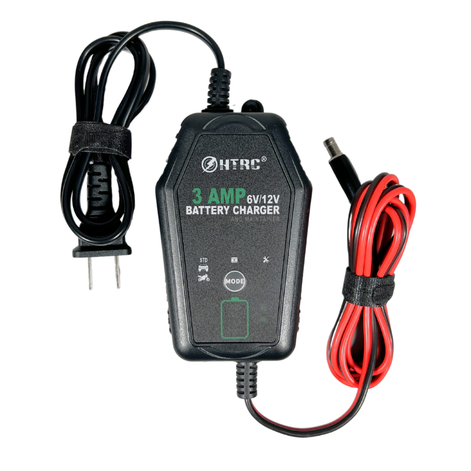

# FieldVolt Wall Charger
{: style="height:300px"}

This documentation covers part number <a
href="https://leemangeophysical.com/product/fieldvolt-wall-charger/"
target="_blank" rel="noopener noreferrer">10-0000182</a>

## Overview
The FieldVolt system is designed to provide field power with less than a minute
of setup, but sometimes you need to charge the system quickly before a
deployment or may be using it for testing equipment indoors. The FieldVolt wall
charger can be connected to the power case internal charging port to provide a
quick 54W charge from wall power.  

We use the power cases around the shop all the time to test instruments, power
mobile equipment, and sometimes just keep our phones and tables charged. These
chargers are a handy way to keep the cases topped off and can be left connected
indefinitely as a trickle charger to keep your cases always ready!  

Streamline your field power system with FieldVolt, where versatility meets
reliability.  

### Whats in the Box
Upon receipt of your unit, unpack the contents of the box and inspect all parts
for any damage incurred during shipping. Immediately report any missing parts or
damage to Leeman Geophysical for replacement. Note that there are many optional
accessories available, see the accessories section of the manual for details and
usage notes.  

* 54W charger with FieldVolt connector pre-installed 

### Features
* 18 VDC, 3A output

* Pre-installed FieldVolt Connector

* Durable Amphenol Industrial Connector  

### Specifications 
<table>
  <tr bgcolor="gray">
    <td><b>Parameter</b></td>
    <td><b>Min</b></td>
    <td><b>Typ</b></td>
    <td><b>Max</b></td>
    <td><b>Unit</b></td>
  </tr>

  <tr>
    <td colspan="5" bgcolor="gray"><b>Physcial</b></td>
  </tr>

  <tr>
    <td>Weight</td>
    <td>-</td>
    <td>-</td>
    <td>-</td>
    <td>g</td>
  </tr>

  <tr>
    <td>Width</td>
    <td>-</td>
    <td>-</td>
    <td>-</td>
    <td>mm</td>
  </tr>

  <tr>
    <td>Length</td>
    <td>-</td>
    <td>-</td>
    <td>-</td>
    <td>mm</td>
  </tr>

  <tr>
    <td>Height</td>
    <td>-</td>
    <td>-</td>
    <td>-</td>
    <td>mm</td>
  </tr>
</table>

## Schematic

<a href="../../10-182_Charging_Cable.pdf" target="_blank" rel="noopener
noreferrer">{: style="height:450px"}</a>

## Revisions
<table>
  <tr bgcolor="gray">
    <td><b>Date</b></td>
    <td><b>Changes</b></td>
  </tr>
  
  <tr>
    <td>May 2024</td>
    <td>Initial Release</td>
  </tr>
</table>

