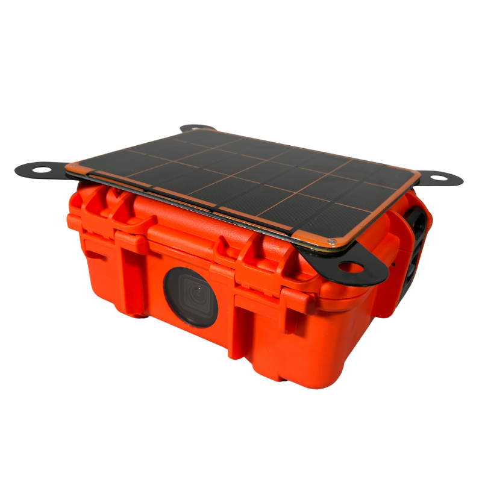

# GeoCapture Time Lapse Case

{: style="height:300px"}

This documentation covers part number <a
href="https://leemangeophysical.com/product/geocapture-time-lapse-camera-case/"
target="_blank" rel="noopener noreferrer">10-0000190</a>

## Overview
The GeoCapture Time Lapse Camera Case is a specialized enclosure designed to hold a GoPro Hero 12 Black camera, allowing you to create breathtaking time-lapse videos of changing landscapes. Inspired by a customer’s use of our MEMS Inclinometer case to capture Alaskan glaciers, we optimized this design to utilize the Hero 12’s full wide-frame video capabilities. The case provides a stable mount for the camera, a battery, and a humidity-reducing desiccant pack to minimize the risk of fogged-up windows. With an integrated solar panel and battery system, your GoPro can run indefinitely in nearly any field environment, making it perfect for extended deployments.

Inside the durable Nanuk case, we’ve included a custom sheet metal frame to secure all components from the lab to the field. The case features tie-down points for anchoring in place during deployment, ensuring stability even in harsh conditions. A crystal-clear window offers unobstructed views while being protected from the elements. Utilizing GoPro Labs features, you can set up your camera to take photos at virtually any interval, optimizing storage space and meeting specific data collection needs. This versatile tool is ideal for monitoring glaciers, mining operations, landslides, avalanche events, construction job sites, and more.

### Whats in the Box
Upon receipt of your unit, unpack the contents of the box and inspect all parts
for any damage incurred during shipping. Immediately report any missing parts or
damage to Leeman Geophysical for replacement. Note that there are many optional
accessories available, see the accessories section of the manual for details and
usage notes.  

* GeoCapture Case  

* Battery  

* Solar panel  

* Desiccant Pack  

### Features

* <b>Designed for GoPro Hero 12 Black:</b> Optimized to utilize the camera’s full wide frame time lapse capabilities.

* <b>Humidity Control:</b> Includes a desiccant pack to reduce the risk of window fogging.

* <b>Solar Powered:</b> Solar panel and battery system keeps the GoPro running indefinitely in most field environments.

* <b>Durable Construction:</b> Nanuk case with a sheet metal frame for secure mounting and protection.

* <b>Stable Mounting:</b> Tie-down points to anchor the case in place during deployments.

* <b>Clear View Window:</b> Provides a crystal clear view while protecting the camera from the elements.

* <b>Versatile Applications:</b> Ideal for monitoring glaciers, mining operations, landslides, avalanches, construction sites, and more.

## Revisions
<table>
  <tr bgcolor="gray">
    <td><b>Date</b></td>
    <td><b>Changes</b></td>
  </tr>
  
  <tr>
    <td>July 2024</td>
    <td>Initial Release</td>
  </tr>
</table>