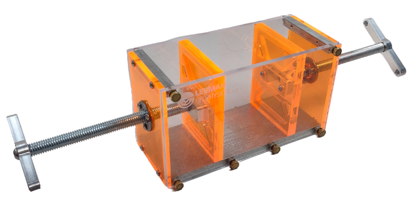

# Geologist’s Squeeze Box

{: style="height:300px"}

This documentation covers part number <a
href="https://leemangeophysical.com/product/geologists-squeeze-box/"
target="_blank" rel="noopener noreferrer">10-0000122</a>.

## Overview
Our squeeze box is perfect for demonstrations in structural geology labs or as a ‘Geologists zen garden’. This updated version is an improvement on our original design. We worked closely with educators to ensure it can stand up to heavy classroom use. It features fully removable sides, allowing the ability to take peels of cross sections. The removable sides also allow the acrylic parts to be replaced if they are damaged.  The screw mechanism has also been updated, making operation smoother and easier.

No matter if you buy this for your classroom, as a curious citizen scientist, or just as a desk toy, we think you’ll find it as mesmerizing and fun to play with as we do! Our lab activity guide has some basic activities to get you started, but the possibilities are endless – you can even learn how to create what geologists call “restored cross-sections” if you want!

### What's in the box
Upon receipt of your unit, unpack the contents of the box and inspect all parts
for any damage incurred during shipping. Immediately report any missing parts or
damage to Leeman Geophysical for replacement.  

* Assembled squeeze box

## Operation Guide
### Basic Operation
1. Make sure you are wearing your safety glasses and working in a safe
   environment with appropriate adult supervision if required.
1. Turn the handle counter clockwise to pull the ram to the back of the squeeze
   box.
1. Using a spoon, create layers of different materials with different colors in
   the squeeze box. Your layers can be different thicknesses, but we recommend
   5-10mm layers to start with. Layer the materials to about 70mm or so - too
   thick and they will run over the top of the squeeze box!
1. Capture the “before” state by drawing the layers on your graph paper and/or
   take a photo. You can use a transparency for measuring movement and
   deformation. Write down what materials each layer is made of and what you
   think will happen to them.
1. Firmly holding the squeeze box down to the table, slowly and steadily crank
   the handle clockwise. Stop periodically (every 10 mm is a good interval) to
   sketch or take photos of the layers.
1. Take photos and sketch the final state of the system. How did your prediction
   (hypothesis) turn out?

### Core Tube Sampling  
1. Cover the sides of the squeeze box so you can’t see the structures by taping
   paper over the windows.
1. Use a spoon to create layers of different materials inside the box. Different
   thicknesses and materials are recommended.
1. Firmly holding the squeeze box down to the table, slowly and steadily crank
   the handle clockwise until the desired displacement is reached. 
1. Firmly press the core tubes into the sample in 3 evenly spaced intervals
   along the length of the box. Hold your thumb over the top and slowly extract
   a core. (be sure to remember the orientation of the sample or even mark the
   orientation.)
1. Draw the structures in each core and discuss the possible overall structure
   with your lab partners.
1. Use the information from the cores to draw your cross section. It will help
   to draw this on a sheet of graph paper. 
1. Once your hypothesized cross section is complete, uncover the sides of the
   squeeze box to see what is actually there. Draw these structures on another
   sheet of graph paper.

### Taking a Sediment Peel

<iframe width="560" height="315" src="https://www.youtube.com/embed/FLkDOfX8aPc?si=HNzZXswJnygoFOr_" title="YouTube video player" frameborder="0" allow="accelerometer; autoplay; clipboard-write; encrypted-media; gyroscope; picture-in-picture; web-share" referrerpolicy="strict-origin-when-cross-origin" allowfullscreen></iframe>

1. After running and experiment with the Squeeze Box, gently pour water over the
   top to ensure that the formation holds together when performing the next
   steps.
1. Take the six thumb nuts off of the front and remove the acrylic panel
   carefully to expose the sediment in the box.
1. Take strips of clear packing tape and stretch them over the exposed sediment
   covering the entire section.
1. Carefully peel away the tape. Left on the tape you should see your sediment
   peel. You can now stick it down onto some paper to preserve the results of
   your experiment.

### Things to try  

<iframe width="560" height="315" src="https://www.youtube.com/embed/tzIelKxWcVM?si=iRfdsdu-5IXjST0_" title="YouTube video player" frameborder="0" allow="accelerometer; autoplay; clipboard-write; encrypted-media; gyroscope; picture-in-picture; web-share" referrerpolicy="strict-origin-when-cross-origin" allowfullscreen></iframe>

* Try making layers of different thicknesses and see what their effect is.
* Try different materials - playdough, coffee, flour, sand, moon sand, and other
  cooking materials are good candidates.
* Try lightly dampening some layers.
* Create the layers with the ram in about ¾ of the way and withdraw it to see
  what happens in an extensional test instead of the compression test.
* After deforming your box, use a shop vac to erode the upper portion of the
  material and observe the patterns created on the surface.
* After deforming the box part way, add more sediment on top, then deform more.
  This simulates complex deposition/deformation patterns that we often see in
  real life.

## Teachers Guide
### Introduction
Welcome to the world of structural geology! Geologists can look at rocks in the
field today and learn about what the Earth was like millions of years ago (or
more!). Over millions of years rocks are pushed around and deform (bend or
break) in many different ways. The squeeze box is a tool that lets you recreate
millions of years of geologic deformation in just a few minutes! The processes
that you can observe in real rocks can be observed in the squeeze box - in fact
tools like this are what scientists use to try to understand how geology works
in the first place!  

We say that the squeeze box is an “analog model” - it is similar to (an analog)
the deformation of real rocks, but it is a model because it is not real rocks
being deformed by the Earth over millions of years. Since we don’t have millions
of years to sit around and watch the rocks, this analog model is a good tool to
try to understand how the rocks deform over geologic time.  

So what can bend and break rocks in the first place? More rocks! The Earth’s
crust, or outer layer of rock, is made up of large blocks of rock called
tectonic plates. These plates are moved around thanks to heat from inside the
Earth. In fact they move about the rate your hair or fingernails grow! These
plates crash into each other, though very slowly, and create massive pressures.
The rocks between the plates get squeezed so hard that they eventually must
deform. Some bend and form arcs that geologists call folds while others break
and slide creating faults. We call movement on these faults earthquakes and they
are very common at plate boundaries such as in Japan, New Zealand, or the west
coast of North and South America.  

As always, when conducting a science experiment, safety comes first! Wear safety
glasses to keep any sand out of your eyes and make sure you have an adult to
help you if needed. Finally, remember the words of Mythbuster Adam Savage “The
difference between screwing around and science is writing it down.” Take lots of
notes and have fun!  

### Lab Activity
* <a href="https://docs.google.com/document/d/1_ukrtYt-NUvjx7G5uUpbuBWwasQ5orbDjec4CXtnwoE/edit" target="_blank" rel="noopener noreferrer">Basic Lab Activity</a>
* <a href="https://docs.google.com/document/d/1ni7TQ4-xyOrLFwiIlzJ49hatRJ2FzKREU-i2q9pWqOA/edit#heading=h.mq2gzs29aged" target="_blank" rel="noopener noreferrer">Core Sampling Lab Activity</a>

## Second Push Plate Installation
To emulate even more complex deformation environments, you may wish to install a
second push plate on the squeeze box. The second push plate can be installed on
any of the orange plastic squeeze boxes with an aluminum base and is available
on our website <a
href="https://leemangeophysical.com/product/geologists-squeeze-box-push-plate/"
target="_blank" rel="noopener noreferrer">HERE</a>.
    

    {: style="height:300px"}
    

    
1. Remove the four screws in the front plate using a #2 Phillips head
   screwdriver, and loosen the two thumb screws on this end.  
    

    {: style="height:300px"}
    

1. Remove the front plate.
    

    {: style="height:300px"}
    

1. Install the new push plate by tilting it and sliding it into the squeeze box.
   You may need to rotate the rear plate so the screw holes line up
    

    {: style="height:300px"}
    

1. Reinstall the screws and tighten until snug. Overtightening may damage the acrylic. 
    

    {: style="height:300px"}
    

1. This concludes the second push plate installation.
    

    {: style="height:300px"}
    

## Repair and Maintenance

<iframe width="315" height="560"
src="https://www.youtube.com/embed/usuumEZrQxQ"
title="YouTube video player"
frameborder="0"
allow="accelerometer; autoplay; clipboard-write; encrypted-media; gyroscope; picture-in-picture; web-share"
allowfullscreen></iframe>

### Upkeep
* To keep the screw mechanism operating smoothly, you should lubricate it
  occasionally. We recommend using <a
  href="https://3inone.com/product/3-in-one-dry-to-touch-dry-lube/"
  target="_blank" rel="noopener noreferrer">3-IN-ONE Dry to Touch Dry Lube</a>.
* Be sure to keep your squeeze box clean! We recommend using light, soapy water
  on a rag. Be sure to dry your box thoroughly, especially the screw mechanism.

### When in Use
* Do not fill your box to the top during use. As you operate the squeeze box,
  the compression will overflow the contents if it is too full or exert
  excessive force.
* Get creative with the materials that you use. You can use colored sand, flour,
  coffee, salt, and more. The possibilities are endless!
* Try not to overstress it. We designed our squeeze box to be rugged but it is
  possible to crack the plastic parts with unnecessary stress.

### Repair
If needed, you can always order spare parts for your squeeze boxes! Just contact our support team for assistance.

## Accessories
* Push Plate Assembly (<a href="https://leemangeophysical.com/product/geologists-squeeze-box-push-plate/" target="_blank" rel="noopener noreferrer">10-0000187</a>)
* Angle Deformation Blocks (<a href="https://leemangeophysical.com/product/angle-deformation-plates/" target="_blank" rel="noopener noreferrer">10-0000184</a>)
* Complex Deformation Blocks (<a href="https://leemangeophysical.com/product/complex-deformation-plates/" target="_blank" rel="noopener noreferrer">10-0000185</a>)

## Revision History
<table>
  <tr bgcolor="gray">
    <td><b>Date</b></td>
    <td><b>Changes</b></td>
  </tr>

  <tr>
    <td>September 2024</td>
    <td>Added video demos for various instructions</td>
  </tr>

  <tr>
    <td>April 2024</td>
    <td>Moved documentation to MkDocs format</td>
  </tr>
</table>