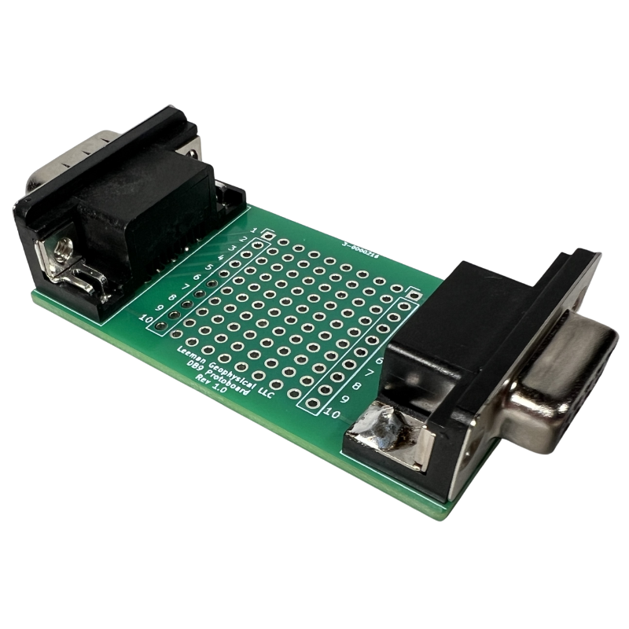
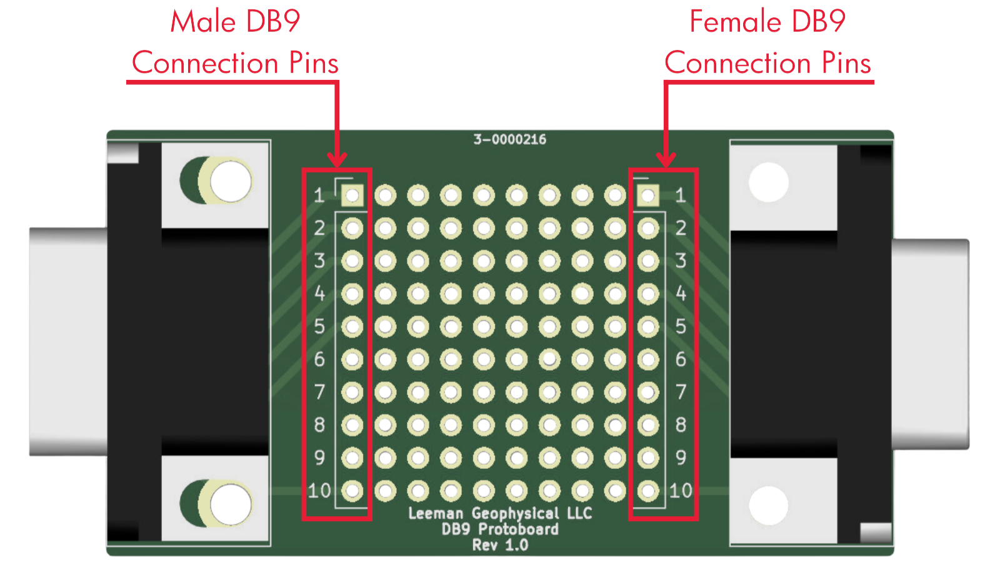
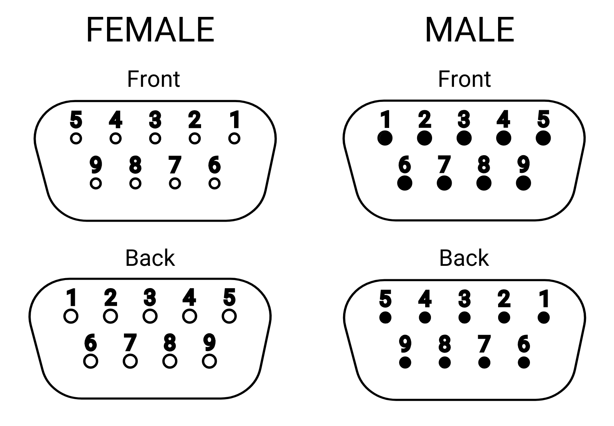

# DB9 Protoboard Breakout

{: style="height:300px"}

This documentation covers The following part number: <a href="https://leemangeophysical.com/product/db9-protoboard-breakout/" target="_blank" rel="noopener noreferrer">7-0000204</a>

## Overview
The DB9 Protoboard Breakout is the ideal solution for anyone working with DB9
cables and connectors. Featuring both male and female DB9 connectors, this PCB
breaks out each pin and the shell connection onto a row of solder pads, complete
with pin numbers for easy identification. The integrated prototyping area allows
you to create custom adapters, filters, injectors, or any other modifications
needed for signals traveling via a DB9 cable. This flexibility enables you to
build and modify circuits directly on the board, providing a tailored solution
for your specific signal requirements.  

Designed for ease of use and versatility, the DB9 Protoboard Breakout ensures
proper signal shielding and reliable performance. Once your customizations are
complete, the entire assembly can be heat-shrunk for a neat and professional
finish. Whether you’re an engineer, technician, or hobbyist, this breakout board
is perfect for projects that require precise and stable signal handling. It also
serves as an excellent troubleshooting tool, making it a valuable addition to
any toolkit.

### What's in the Box
Upon receipt of your unit, unpack the contents of the box and inspect all parts
for any damage incurred during shipping. Immediately report any missing parts or
damage to Leeman Geophysical for replacement.  

* DB9 Protoboard Breakout PCB Assembly

### Features
* <b>Dual DB9 Connectors:</b> Includes both male and female DB9 connectors for convenient pass through connection into existing equipment.  
* <b>Pin and Shell Breakout:</b> Each pin and the shell are broken out onto solder pads, ensuring proper shielding and ease of use.  
* <b>Prototyping Area:</b> Equipped with a proto area for building custom adapters, filters, injectors, and more.  
* <b>Customizable Solutions:</b> Enables the creation of tailored solutions for any application.  
* <b>Versatile Application:</b> Ideal for engineers, technicians, hobbyists, and anyone needing custom DB9 signal solutions.  

## Configuration
### DB9 Pin Connection Points

{: style="height:300px"}

### DB9 Pin Configuration 

{: style="height:300px"}

## Revisions
<table>
  <tr bgcolor="gray">
    <td><b>Date</b></td>
    <td><b>Changes</b></td>
  </tr>

  <tr>
    <td>September 2024</td>
    <td>Initial Release</td>
  </tr>
</table>

