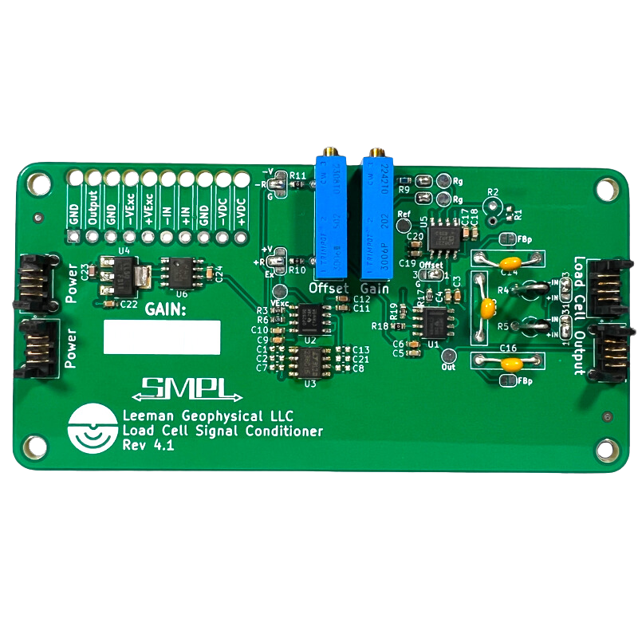
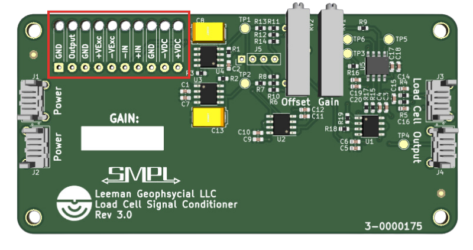
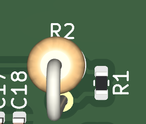

# SMPL Load Cell Signal Conditioner

{: style="height:300px"}

This documentation covers part number <a href="https://leemangeophysical.com/product/smpl-load-cell-signal-conditioner/" target="_blank" rel="noopener noreferrer">7-0000132</a>

## Overview
### Introduction 
Load cells are found in just about every laboratory – we always need to weigh
something or monitor the force change in some process. Load cells are available
in ranges from grams to tonnes, but this single board can work with them all!  

The output from a load cell is generally of the order of millivolts, which is
just too small to be sent over any distance or to be of much use without a very
high bit depth and expensive analog to digital converter. The load cell signal
conditioner module makes it fast and easy to amplify and offset the output of
your load cell to match your data collection system.  

Amplification is the main requirement for signal conditioning a load cell. The
very small output voltages need to be increased to better utilize the range of
the data acquisition system they are being connected to. Often your DAQ system
may be able to read +/- 10 VDC, so why send it a signal only a thousandth of the
range you paid for?  

Offsetting is another handy feature. Offsets allow you to shift the output of
the amplifier up and down by a fixed DC voltage. This can be useful if you need
0 VDC out to be a zero load with some rare weight on the load cell. This
function can also be used to better utilize the full range of your Data
Acquisition Device. Why only use 0 to 10 VDC when your system can measure -10 to
10? It’s like doubling your resolution at no extra cost.  

Loads cells work best when we provide them very clean and stable power. If the
load cell’s excitation voltage is messy, the output signal will reflect that.
Each signal conditioner is equipped with an on-board precision voltage supply,
providing clean excitation power to the load cell.  

Finally, the load board offers a way to apply an input filter to clean up your
signal. The unpopulated components allow you to build a differential and common
mode low pass filter in which you decide and set the cutoff frequency. This is
great for removing noise from the power supply, adding an anti-alias filter, or
just cleaning up a slow signal. Use our free filter calculator to determine the
component values you should use.  

### Whats in the box
Upon receipt of your unit, unpack the contents of the box and inspect all parts
for any damage incurred during shipping. Immediately report any missing parts or
damage to Leeman Geophysical for replacement. Note that there are many optional
accessories available, see the accessories section of the manual for details and
usage notes.  

* SMPL Load Cell Signal Conditioner PCBA

### Connections
The unit has four connectors **(J1-J4)**. **J1** is a power connector and **J2** serves as a secondary power input/output to allow daisy chained power between multiple units. **J3** is the load cell input and **J4** is the output connector. The SMPL four position cables for use with the Load Cell Signal Conditioner are linked in the Accessories section

{: style="height:300px"}

In addition to the four push connectors, the load cell signal conditioner has
all of the pins broken out to the strain relieved through hole solder
connections, located at the upper left side of the board.

{: style="height:300px"}

<table>

  <tr bgcolor="gray">
    <td><b>Pin</b></td>
    <td><b>Description</b></td>
  </tr>
  
  <tr>
    <td>GND</td>
    <td>Ground</td>
  </tr>

  <tr>
    <td>Output</td>
    <td>Signal Output</td>
  </tr>

  <tr>
    <td>GND</td>
    <td>Ground</td>
  </tr>

  <tr>
    <td>VExc+</td>
    <td>Positive excitation voltage</td>
  </tr>

  <tr>
    <td>VExc-</td>
    <td>Negative excitation voltage</td>
  </tr>

  <tr>
    <td>In-</td>
    <td>Negative load cell signal in</td>
  </tr>

  <tr>
    <td>In+</td>
    <td>Positive loadcell signal in</td>
  </tr>

  <tr>
    <td>GND</td>
    <td>Ground</td>
  </tr>

  <tr>
    <td>VDC-</td>
    <td>Negative voltage supply</td>
  </tr>

  <tr>
    <td>VDC+</td>
    <td>Positive voltage supply</td>
  </tr> 

</table>

## Specifications
<table>
  <tr bgcolor="gray">
    <td><b>Parameter</b></td>
    <td><b>Min</b></td>
    <td><b>Typ</b></td>
    <td><b>Max</b></td>
    <td><b>Unit</b></td>
  </tr>

  <tr>
    <td colspan="5" bgcolor="gray"><b>DC Input</b></td>
  </tr>

  <tr>
    <td>Voltage +</td>
    <td></td>
    <td></td>
    <td></td>
    <td>VDC</td>
  </tr>

   <tr>
    <td>Voltage -</td>
    <td></td>
    <td></td>
    <td></td>
    <td>VDC</td>
   </tr>

  <tr>
    <td>Current</td>
    <td>-</td>
    <td>-</td>
    <td>-</td>
    <td>mA</td>
  </tr>

  <tr>
    <td colspan="5" bgcolor="gray"><b>Transducer Excitation</b></td>
  </tr>

  <tr>
    <td>Voltage</td>
    <td>-</td>
    <td>-</td>
    <td>-</td>
    <td>VDC</td>
  </tr>

  <tr>
    <td colspan="5" bgcolor="gray"><b>Physical</b></td>
  </tr>

  <tr>
    <td>Weight</td>
    <td>-</td>
    <td>-</td>
    <td>-</td>
    <td>g</td>
  </tr>

  <tr>
    <td>Width</td>
    <td>-</td>
    <td>-</td>
    <td>-</td>
    <td>mm</td>
  </tr>

  <tr>
    <td>Length</td>
    <td>-</td>
    <td>-</td>
    <td>-</td>
    <td>mm</td>
  </tr>

  <tr>
    <td>Height</td>
    <td>-</td>
    <td>-</td>
    <td>-</td>
    <td>mm</td>
  </tr>
</table>

## Hookup Guide
1. Ensure all power is off. **DO NOT power on the system until all steps of
setup, including adjustment are complete, otherwise damage to the transducer may
result!**

1. Connect power to the PCB either via one of the two identical 4-pin SMPL
connectors labeled power or via the through hole terminals GND, VDC-, and VDC+.

1. Connect the transducer via the either the 4-pin SMPL connector labeled **Load Cell**
or the through hole terminals VExc-, VExc+, -IN, and +IN. Reversing the input
connections will reverse the sign of the output.

1. Connect the output to the desired recording or measurement system via either
   the 4-pin SMPL connector or the through hole terminals GND, and OUT.

1. Proceed to the adjustment section BEFORE powering on the system or damage to
your transducer may result!

## Adjustment procedures
### Offset Adjustment Procedure

### Gain Adjustment Procedure

## Testing

## Advanced Features
### Applying Offset
In some situations it may be desirable to offset the output of the system to
work with a given digitizer or other constraint. The Load Cell Signal Conditioner has
the option to enable a variable offset allowing the zero output of the
transducer to be set to nearly the full input voltage of the circuit. Typically
this control is operated to offset the zero output to be within the range of -10
to 10 VDC.

To enable the offset feature, move the solder jumper labeled Offset from the GND (G/3)
pad to the Variable pad (1). Now turning the Offset potentiometer clockwise will
increase the output offset and counter clockwise will decrease the offset. 

{: style="height:250px"}

*Offset jumper on the PCB. Bridge connections 3 and 2 for no offset. Bridge connections 2 and 1 for variable offset.* 

### Applying Gain
### Applying Variable Gain
Some load cells may not produce a large enough output swing to maximize the
full dynamic range of the digitizer or connected system. Variable gain can be
applied to the signal to allow easy adjustment of the gain to optimize the
transducer to system match. 

Two solder jumpers must be closed to enable the variable gain potentiometer.
Once closed, the system will apply a gain set by the value of the potentiometer
according to equation below. The value of the gain resistor
can be measured by the two test points labeled Rg on the circuit board.

$$(Insert~gain~formula)$$

{: style="height:250px"}

*Bridge the connections on the two gain jumpers to apply a variable gain. The gain resistance can be measured across the to test points labeled Rg.*

### Applying Fixed Gain
Applying a fixed gain requires determining a gain resistor value and soldering
it onto the circuit board, but has the advantage of being able to apply a very
well known gain and reducing the effects of gain drift error from temperature
changes modifying the resistance of the potentiometer used to apply a variable
gain. This is the preferred method to apply gain, but requires additional parts
and is not easily adjustable in system to accommodate transducer or requirement
changes on the fly.

To apply a fixed gain, ensure that the solder jumpers for the variable gain
potentiometer are NOT bridged. Calculate the resistor value needed to achieve
the desired gain:  

$$(Insert~gain~formula)$$

You'll need to then pick the closest standard value (E-Series) resistor to the
calculated value. Checkout our handy explanation of the E-Series resistors over
in [this blog post](https://leemangeophysical.com/why-standard-resistor-values-are-strange/).
If you do not want the gain to be any higher than the ideal gain, err on
choosing a resistor larger than the calculated value such that the gain would be
slighlty less than the calculated gain.

We recommend using 1% or better resistors with low thermal coefficients for the
best results. The resistor may be a through hole resistor and soldered into
position R2 (standing on end) or an 0603 surface mount resistor soldered to
position R1 on the circuit board. There is a silkscreen printed area to write
the applied gain value on for future reference on the front of the circuit
board.

{: style="height:250px"}

*Fixed gain can be set by populating the axial resistor footprint R2 or the 0603 surface mount footprint R1.*

### Reversing Polarity
To reverse the input polarity change the solder bridge nearest the connector labeled Load Cell to -IN and the jumper nearest the connector labeled Output to +IN. This will connect the nominally -IN pin to the +IN terminal of the instrumentation amplifier and the +IN pin to the -IN terminal.

{: style="height:250px"}

*Input polarity of the transducer can be reversed by moving the solder bridges on the jumpers to the positions most inner to the centerline of the PCB.*

## Trouble Shooting
**Issue: No change in output when load is applied**  
* Verify that all connections are correct.
* Probe the Output test point with respect to ground. If signal is present, the issue is after the circuit or with the output connection itself.
* Verify that the input polarity solder jumpers are set (see Advanced Features).
* Verify that the offset solder jumper is set (see Advanced Features).

**Issue: Offset potentiometer has no effect**  
* Verify that the offset solder jumper is set to Variable (see Advanced Features).

**Issue: Gain Potentiometer has no effect**  
* Verify that both Rg solder jumpers are closed (see Advanced Features).

## Accessories
[SMPL Cables](../smpl_cables.md)   
SMPL cables are the glue that holds the SMPL system together. These 4 pin cables are the backbone of the system and is based on the Molex Picoflex line of connectors. 

## Revisions
<table>
  <tr bgcolor="gray">
    <td><b>Date</b></td>
    <td><b>Changes</b></td>
  </tr>

  <tr>
    <td>May 2024</td>
    <td>Moved Documentation to MkDocs Format</td>
  </tr>
</table>