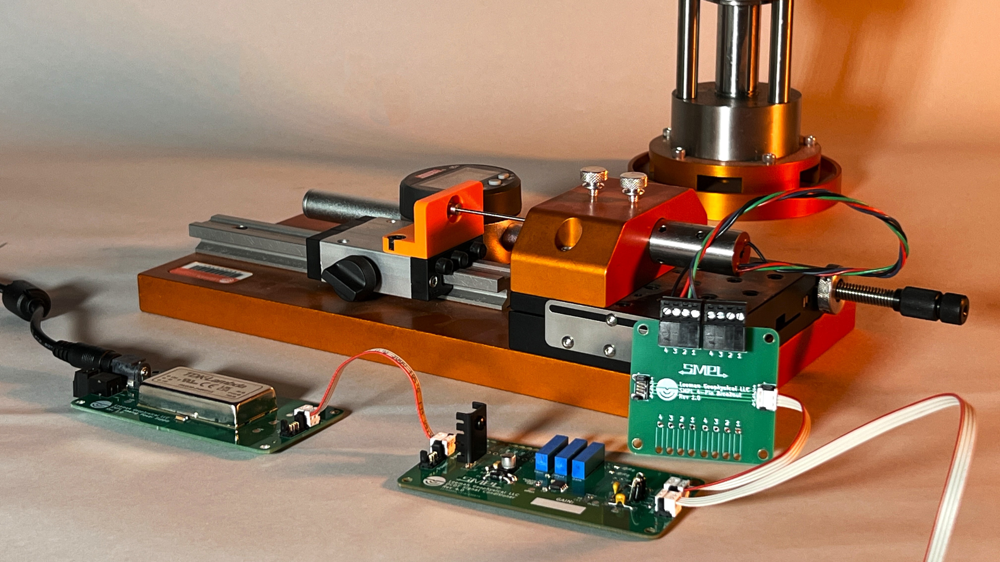
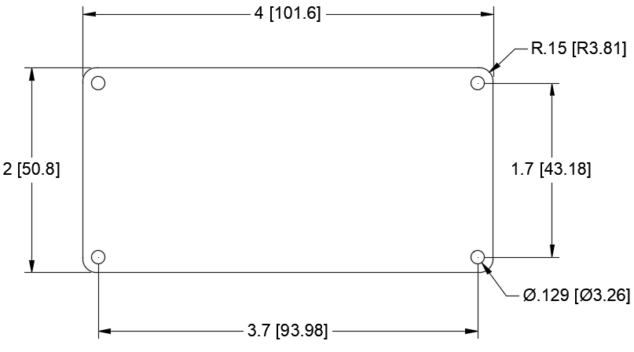

# SMPL Standard

SMPL is an open standard. That means Leeman Geophysical LLC is sharing the
mechanical dimensions and electrical pinouts to allow interfacing to and from
any other system as well as creation of your own custom interfaces.

## Mechanical Footprint
SMPL boards are standardized to the full size (1S) and half size (0.5S) circuit
board sizes. This standardization makes creating enclosures much easier as well
as allowing standard mounting brackets, drill templates, and more to be used.

### Mounting Holes
All mounting holes in SMPL circuit boards are 0.1285 inches (3.26 mm) in
diameter. This allows for the use of both imperial \#4 hardware as well as
metric M3 hardware. The system is designed in the USA and imperial hardware is
the preferred standard, but both imperial and metric are accommodated as
imperial hardware can be difficult to obtain outside the USA.

### Potentiometer Spacing
All adjustment potentiometers are spaced 0.3 inches from adjustment screw center
to adjustment screw center unless the part required makes this impossible. The
position of potentiometers on the circuit board is always on the top of the
board facing the outward or front side. Positioning along the long axis is
as-required.

{: style="height:250px"}

*1S (full size) SMPL circuit board dimensions.*

{: style="height:250px"}

*0.5S (half size) SMPL circuit board dimensions.*

## Connectors
The SMPL system is built around push on connectors from the Molex Picoflex PF-50
90325 family. These connectors are a micro blade style connector that is keyed
to prevent reverse connections. Cables in many lengths as well as connectors of
many different pin counts are available from this long time component
manufacturer. The connectors have a space saving 0.05 inch (1.27 mm) pitch, yet
are still rated for 1.2A and 250V.

Connector `pin 1' is marked on the PCB with a small round dot and is always on
the side of the connector with the wider key post. To reduce confusion between
numbered connectors such as D-Sub connectors, the simple connector pins are
denoted with letters. Pin A (pin 1) counts up through the standard English
alphabet towards the smaller key post on the connector.

Connectors are arranged if at all possible with:

* Power on the left as viewed from the top.
* Sensor inputs/outputs on the right as viewed from the top.
* With adjacent connectors turned opposite ways with pin A towards the center
line of the PCB to increase ease of connecting and disconnecting multiple
cables.

## Standard Pinouts
The pinouts of these connectors are standardized for different functions within
the SMPL ecosystem. Some of these are necessary for many modules to work
together (such as power connections) and others are standards established to
help make all systems as similar as possible to help with interchangeability and
troubleshooting (such as how a load cell is connected to a DB9 connector).

### Analog Power (+/- 15 VDC Typ.)
<table>
  <tr bgcolor="gray">
    <td><b>Pin</b></td>
    <td><b>Description</b></td>
  </tr>
  <tr>
    <td>A</td>
    <td>Ground</td>
  </tr>
  <tr>
    <td>B</td>
    <td>-VDC</td>
  </tr>
  <tr>
    <td>C</td>
    <td>+VDC</td>
  </tr>
  <tr>
    <td>D</td>
    <td>Not Connected</td>
  </tr>
</table>

### Digital Power (3.3, 5 VDC Typ.)
<table>
  <tr bgcolor="gray">
    <td><b>Pin</b></td>
    <td><b>Description</b></td>
  </tr>
  <tr>
    <td>A</td>
    <td>Ground</td>
  </tr>
  <tr>
    <td>B</td>
    <td>3.3 VDC</td>
  </tr>
  <tr>
    <td>C</td>
    <td>5 VDC</td>
  </tr>
  <tr>
    <td>D</td>
    <td>Not Connected</td>
  </tr>
</table>

### Analog Signal (Single Ended)
<table>
  <tr bgcolor="gray">
    <td><b>Pin</b></td>
    <td><b>Description</b></td>
  </tr>
  <tr>
    <td>A</td>
    <td>Ground</td>
  </tr>
  <tr>
    <td>B</td>
    <td>Signal</td>
  </tr>
  <tr>
    <td>C</td>
    <td>Not Connected</td>
  </tr>
  <tr>
    <td>D</td>
    <td>Not Connected</td>
  </tr>
</table>

### Analog Signal (Differential)
<table>
  <tr bgcolor="gray">
    <td><b>Pin</b></td>
    <td><b>Description</b></td>
  </tr>
  <tr>
    <td>A</td>
    <td>Ground</td>
  </tr>
  <tr>
    <td>B</td>
    <td>+ Input</td>
  </tr>
  <tr>
    <td>C</td>
    <td>- Input</td>
  </tr>
  <tr>
    <td>D</td>
    <td>No Connection</td>
  </tr>
</table>
Note - optional jumper to connect C to ground making this equivalent to the single ended connector.

### Transducer
<table>
  <tr bgcolor="gray">
    <td><b>Pin</b></td>
    <td><b>Description</b></td>
  </tr>
  <tr>
    <td>A</td>
    <td>- Excitation or Ground</td>
  </tr>
  <tr>
    <td>B</td>
    <td>- Input</td>
  </tr>
  <tr>
    <td>C</td>
    <td>+ Excitation</td>
  </tr>
  <tr>
    <td>D</td>
    <td>+ Input</td>
  </tr>
</table>

## Recommended DB9 Pinouts
We love using DB9 connectors to interface a variety of sensors to our systems.
They are inexpensive, robust, and work great for low frequency signals like many
of those encountered in our labs and industrial environments. Now, with our [DB9
breakouts](./db9_breakouts/db9_breakouts.md), you can effortlessly connect any
DB9 to any 4-pin SMPL device, expanding compatibility across your equipment.  

### DCDT
<table>
  <tr bgcolor="gray">
    <td><b>Wire Color</b></td>
    <td><b>SMPL Pin</b></td>
    <td><b>DB9 Pin</b></td>
    <td><b>Description</b></td>
  </tr>
  <tr>
    <td>Black</td>
    <td>A</td>
    <td>4</td>
    <td>GND</td>
  </tr>
  <tr>
    <td>White</td>
    <td>B</td>
    <td>8</td>
    <td>-Input</td>
  </tr>
  <tr>
    <td>Red</td>
    <td>C</td>
    <td>2</td>
    <td>Excitation</td>
  </tr>
  <tr>
    <td>Green</td>
    <td>D</td>
    <td>7</td>
    <td>+Input</td>
  </tr>
  <tr>
    <td>Shield</td>
    <td>S</td>
    <td>3</td>
    <td>Shield to Case GND</td>
  </tr>
</table>

### Load Cell
<table>
  <tr bgcolor="gray">
    <td><b>Wire Color</b></td>
    <td><b>SMPL Pin</b></td>
    <td><b>DB9 Pin</b></td>
    <td><b>Description</b></td>
  </tr>
  <tr>
    <td>Black</td>
    <td>A</td>
    <td>5</td>
    <td>-Excitation(GND)</td>
  </tr>
  <tr>
    <td>White</td>
    <td>B</td>
    <td>9</td>
    <td>-Input</td>
  </tr>
  <tr>
    <td>Red</td>
    <td>C</td>
    <td>1</td>
    <td>+Excitation</td>
  </tr>
  <tr>
    <td>Green</td>
    <td>D</td>
    <td>6</td>
    <td>+Input</td>
  </tr>
  <tr>
    <td>Shield</td>
    <td>S</td>
    <td>3</td>
    <td>Shield to Case GND</td>
  </tr>
</table>

### General Analog
<table>
  <tr bgcolor="gray">
    <td><b>SMPL Pin</b></td>
    <td><b>DB9 Pin</b></td>
    <td><b>Description</b></td>
  </tr>
  <tr>
    <td>A</td>
    <td>8</td>
    <td>-Input</td>
  </tr>
  <tr>
    <td>B</td>
    <td>7</td>
    <td>+Input</td>
  </tr>
  <tr>
    <td>S</td>
    <td>3</td>
    <td>Shield to Case GND</td>
  </tr>
</table>

## Revision History
<table>

  <tr bgcolor="gray">
    <td><b>Date</b></td>
    <td><b>Changes</b></td>
  </tr>

  <tr>
    <td>September 2024</td>
    <td>Initial Release</td>
  </tr>

</table>