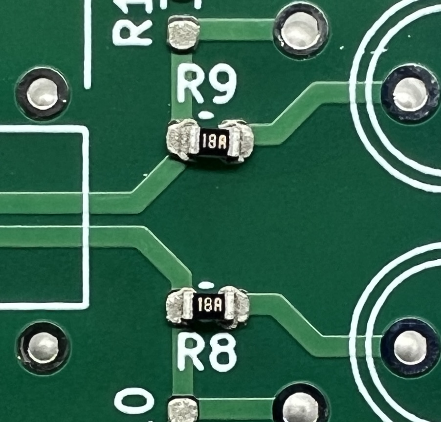
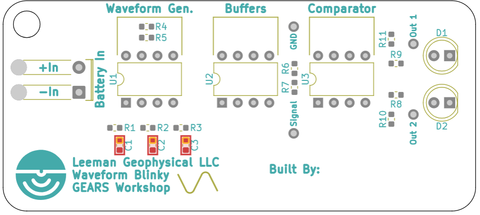
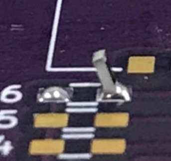
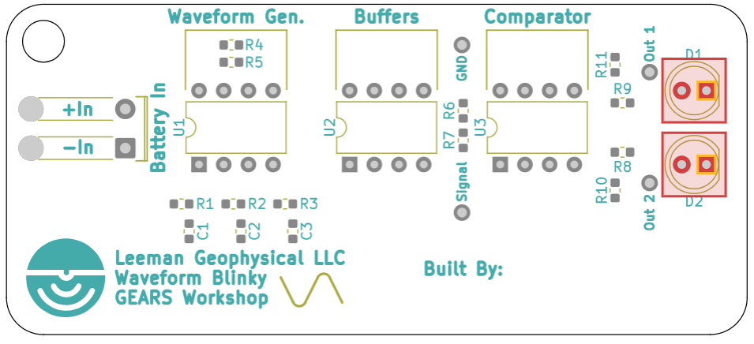
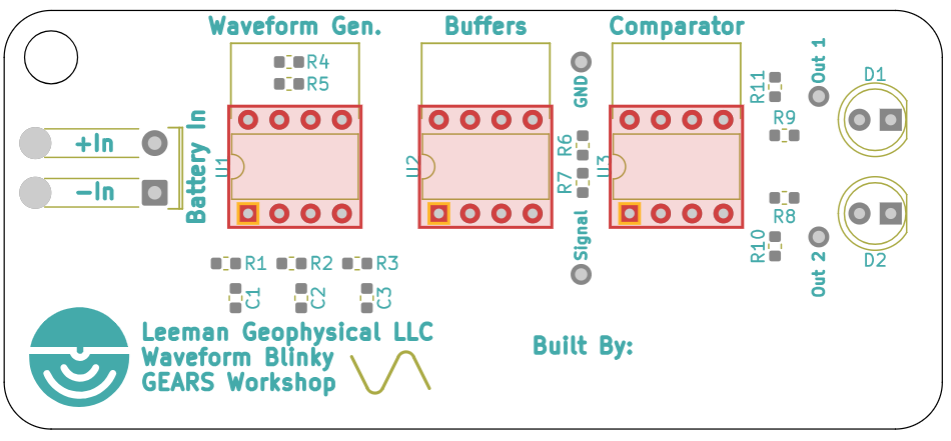
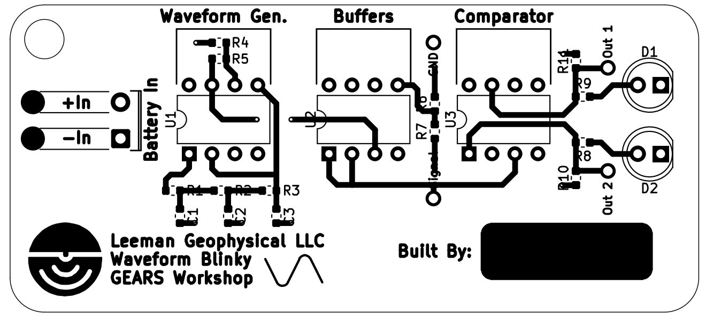

# Waveform Blinky PCB Assembly Guide

{: style="height:400px"}

### Required Equipment
- Soldering Iron
- Solder
- Flush cutters
- Popsicle sticks 
- Card Scraper
- Tweezers
- Safety glasses
- Wire strippers (optional)
- Solder Paste/Heat gun (for reflow assembly if desired)

### Kit Components
1. x1 - Circuit Board (PCB)
1. x5 - 10k Ohm Resistor
1. x1 - 110K Ohm Resistor
1. x3 - 100K Ohm Resistor
1. x2 - 150 Ohm Resistor
1. x3 - LMC648 Op-Amp
1. x3 - 1uF Capacitor
1. x2 - Red LED
1. x1 - 9V Battery Clips

{: style="height:400px"}

### Safety Considerations
- Assembling this kit requires the use of hot and sharp tools.
- Wear safety glasses when assembling this kit. Clipped leads can shoot away
  quickly and cause eye injury.
- This kit and the solder you are using may contain lead. Wash hands thoroughly
  after assembling and do not eat while working or ingest any kit materials.
- Always ensure your work area is clean and safe. Never leave a hot or sharp
  instrument unattended.

## Assembly 
### Applying Solder Paste
Using the kit contents checklist - layout and inventory your kit. Make sure you
have all  parts before beginning! The first stage in populating surface mount
components is to add solder paste via the included stencil. (If you would like
to hand solder these components, that can be done with tweezers and an iron as
well instead.)  

1. Tape the PCB down to a flat surface. Be sure to avoid covering up the target
   component footprints.  
   {: style="height:300px"}

1. Lay the stencil over the PCB until all the holes line up evenly with the
   footprints. Carefully hold down the aligned stencil and tape the top and
   bottom down.   
   {: style="height:300px"}

1. Next you will cover the footprints generously with room temperature solder
   paste. Use an old card as a squeegee and squeegee across the stencil. This
   process is similar to silk screening a t-shirt logo. Paste should be left
   only on the desired component footprints.  
   {: style="height:220px"} {: style="height:220px"}

1. You will now carefully peel back the tape holding the stencil down, and
   gently lift it off of the pcb. This process (steps 3-5) may take a few
   attempts to get an even layer of paste on all the footprints. Your blinky
   should now be properly pasted and ready for components.  
   {: style="height:300px"}

### Placing Surface Mount Components
1. It’s time to start placing the surface mount devices (SMD)! Start by locating
   both of your 150 Ohm resistors. Resistors like these are not polar and can be
   placed in any orientation as long as each side of the resistor is touching a
   corresponding copper pad, and the black side is facing up. Using a pair of
   tweezers, gently place 2 of them onto the footprints labeled R8 and R9. View
   the image below for their locations.  
   {: style="height:200px"}
   {: style="height:200px"}
    
1. Locate your (qty5) 10k resistors and place them onto the footprints labeled R4, R6,
   R7, R10, and R11 in the same manner as the previous step. Again, these are
   non-polar components.
   {: style="height:200px"}

1. Next you will place the 110k resistor on the footprint R5.
   {: style="height:200px"}

1. For the last of the resistors you will take the (qty3) 100k resistors and place them on the footprints R1, R2, and R3.  
   {: style="height:200px"}

1. Finally you will take the (qty3) 1uF Capacitors and place them on the the
   footprints C1, C2, and C3. Although some capacitors are polar, these like the
   resistors are not. They can be placed in any orientation so long as each edge
   makes contact with the pads of the footprints.  
   {: style="height:200px"}  

All of the SMD components are now placed and the PCB is ready to be reflowed.
This can be done in multiple ways. While it is common in large production to use
a dedicated reflow oven with 4 or more different temperature zones and a
conveyor to move the PCBs through them, the same thing can be done carefully
with a heat gun or a toaster oven.  Solder generally has a reflow temperature
profile that specifies what temperature they should be at during the reflow
timeline. In industrial operations, this is very important, but for learning how
to reflow we can relax a bit more as long as we don’t burn the PCB!  
{: style="height:400px"} 

### Heatgun Reflow Process
Using a heat gun to reflow your PCB is a less precise method, but often works
much faster for low component quantity PCBs. Set your heat gun to about 350°C
and set the air flow to a low setting to avoid blowing components off of the
PCB. Move the heat gun back and forth slowly over the components until the paste
changes from a dull gray to its shiny silver melted state. After the paste has
melted, continue to apply heat for about 5 seconds to ensure it has properly
reflowed. Repeat this process for each component until all of them have
reflowed.  

<b>Note:</b>Any crooked parts placed on the board will be pulled into line by
the surface tension of the melted solder, so long as all component contacts are
touching their respective footprint pad. If there is not good contact before
reflowing, or if there are uneven quantities of paste between pads, your
component may be pulled harder by one pad, pulling it into an upright position.
This is called tombstoning and is fixed by reflowing the solder again with the
heat gun, and using a pair of tweezers to push down the part onto the
disconnected pad.  
Tombstoned: {: style="height:150px"} Correct:
{: style="height:150px"}  

### Toaster Oven Reflow Process
<b>CAUTION:</b> DO NOT USE AN OVEN USED FOR FOOD, THIS PROCESS IS TOXIC.  

This alternate method of reflowing is a little bit more precise, but takes more
care as a mistake can burn your board, rendering it useless. For this method we
will replicate the same process as a standard reflow oven. By using a timer and
a temperature sensor to monitor and adjust our oven, we will match the reflow
chart for our paste as accurately as possible.  

Here is a four stage reflow process to follow for leaded solder paste:  
(Modeled after the SMD291AX250T4 solder paste)  

1. Preheat: 0°C - 150°C over two minutes (302°F)  
1. Soak:  150°C - 183°C over 1.5 - 2 minutes (361°F)  
1. Reflow: 183°C - 220°C over 30 seconds (428°F)  
1. The PCB should reflow at some time within step three. Watch closely for when
   the board has fully reflowed and turn off the oven after 5 seconds. Leave it
   to cool for 1 minute, and then open the door.  

Note:

- If available, use a smoke absorbing filter when opening the door to eliminate
  fumes from the solder flux.  
- Do not remove the PCB until the board is cool enough to pick up by hand.
  Picking up the board too soon may mean your solder is still molten and your
  parts will slide off.  

### Through Hole Components Soldering

1. You will now begin hand-soldering all of the Through Hole Devices (THD).
   Start by locating the two light emitting diodes (LEDs). LEDs are polar
   components. Though it will fit in its footprint in two different
   orientations, only one will function properly.Their orientation is marked
   with a flat edge on the LED, and/or a short lead. The shorter lead closest to
   this flat edge is the Cathode, and is connected to the negative side of the
   circuit. For our purpose, you can simply match the flat edge on the LED to
   the flat line of the footprint.  
   {: style="height:220px"}  {: style="height:220px"}  

1. Flip over the PCB. Pull the leads tight and bend them out as pictured. Solder
   the connections and clip the leads. If a bridge of solder forms between the
   two leads, use the iron to remelt and try to separate them completely.  
   {: style="height:220px"}  

1. Take the last remaining components the (qty3) LMC648 Op-Amps and solder them
   into the remaining footprints U1, U2 and U3. These components are polar, and
   the notch in the silkscreen on the board should be aligned with the notch on
   the chip itself. You may find these chips easier to solder on one at a time.
   {: style="height:220px"}  

1. The final step in assembly you Waveform Blinky is to solder on the battery
   clip. The footprint for this is designed to create a strain relief for the
   wires. To install the wires feed them up through the bottom of the board in
   the holes closest to the edge, the feed the stripped wire down into the inner
   holes. Solder the wires and them pull then Tight.  
Red -> +In  
Black -> -In  
{: style="height:220px"}  

### Trouble Shooting
- Check your connections for unsoldered or bridged solder joints. The pads should be fully covered with no exposed copper.
- Make sure all of the polar parts are soldered on in the correct orientation.
- Make sure the power wires are soldered on correctly.
- Ensure your battery is not faulty

## How it Works
As soon as a power supply is applied to this circuit, the Waveform blinky begins
to alternate the lighting of two LEDs. This circuit utilizes some clever analog
design tricks to do this with no programming and no computer. In this case,
there are a total of 6 operation amplifiers (Op-Amps) serving to generate a sign
wave, buffer it, and read the signal with a comparator to produces an
alternating output to activate the two lights. Op-Amps are a versatile component
used in many electronics. Simply by changing the configuration of the components
and connections around the op-amp, you can drastically alter its function.
Although there are many simpler ways to configure the LEDs to blink in this way,
this circuit serves as a demonstration of the diverse utility of op-amps, and
provides test points to aid in the study of the signal chain for educational
purposes.  
In the first stage of the blinky PCB (Function Generation), an op-amp creates a
sine wave through an old but effective circuit called an RC Phase shift
Oscillator. Popular in many fields of electronics, this chunk of the circuit
works by creating a regenerative feedback loop. It utilizes a network comprized
of resistors and capacitors to create a phase shift in the signal. This is a
type of intentional interference that creates an oscillation. The op-amp in the
loop serves to boost the signal so that it does not dissipate over time, which
in turn maintains a constant amplitude. After this sine wave is generated, it is
fed into another op-amp which is configured as a voltage follower, or buffer.
The buffer that the signal is fed into serves to take in external power and uses
it to fortify the signal. Using a buffer between a signal and its destination
ensures that the current draw on the signal cannot alter it. The other voltage
follower in this circuit serves to buffer the 4.5V coming out of the 10k voltage
divider. As voltage is simply a measure of difference in charge between two
points, the middle point of the 9V battery can be called 0V or ground, and we
can call the positive terminal of the battery 4.5VDC in reference to our virtual
ground. The negative terminal in this configuration would then become -4.5VDC.
These power rails are then used to power all the other op-amps in the circuit.
Continuing on down the signal chain, the signal is finally fed into two op-amps
which together act as a comparator. When there is no feedback loop from an
op-amps output to its input, the output fully saturates to the positive power
rail as long as the positive input is greater than the negative input. So, with
the negative input of one of our op-amps, and the positive of the other both
referenced to our virtual ground (the sine waves midpoint), we feed the signal
into the remaining inputs. As the signal rises above the midpoint, the op-amp
with the signal fed to the positive input will saturate, which will activate its
LED. As the signal dips below the midpoint, the output of the amplifier with the
signal connected to the negative terminal will turn on. This creates an
alternating blinking pattern at the frequency of the sine wave generated at the
beginning of the circuit.  

{: style="height:350px"}  
{: style="height:315px"}  