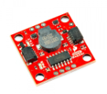

# Skyguard Cutdown Pro

## Introduction
The SkyGuard Cutdown Pro is the only cutdown on the market designed for heavy
scientific payloads and ultimate end user configurability. After participating
in balloon launches, working with several ballooning groups, and extensive
laboratory testing, the SkyGuard Cutdown Pro has been optimized to make flight
termination easy.

This cutdown is also open source! The schematic of the circuit board, the
firmware, and the 3D printed enclosure are all freely available. This allows
complete customization of the system to suit your specific needs. We firmly
believe that this is a better solution than producing a product with myriad
settings that requires a lot of effort to configure and may still not do exactly
what your research requires. Other features such as serial connections, QWIIC
connectors, and more make it easy to expand the hardware connected to the
cutdown. In some cases, the cutdown could even be the whole flight package.

## What’s in the Box
* Assembled SkyGuard Cutdown Pro in a 3D printed enclosure with acrylic lid
* Extra 30 gauge nichrome “hot” wire

## What You’ll Need
* Rigging supplies (paracord, monofilament, crimps, etc)
* Lithium 9V Battery (Energizer 9V Ultimate Lithium recommended)
* USB Mico cable
* Vacuum Grease (optional)
* CR1220 Battery (optional)

## Overview
Your cutdown consists of a 3D printed enclosure, a laser cut acrylic lid, five
thumb nuts, a power switch, and the main circuit board. On the main circuit
board there are connectors for external triggers, sensors, and more. There is
also a status indicating LED, detailed later in the operation section of the
manual.

We recommend installing a CR1220 battery into the on-board coin cell holder.
While not necessary, this battery helps the GPS by storing warm/hot start
information, decreasing the time to get a 3D fix. Operational Flow The SkyGuard
Cutdown Pro has three modes of operation: disarmed, armed, and complete. The
movement between these modes is determined by user selectable settings. When the
unit is disarmed it is ready to fly, but has not reached conditions set to be
considered “in flight”. Armed mode indicates that the unit is now in flight and
the mission elapsed time (MET) counter has started. In armed mode the cutdown
variables set by the user are being monitored to see if a cutdown operation is
necessary. Finally, after a cutdown has completed, the system goes to the
complete state.

Cutdown comparisons (say to cutdown at a certain pressure or rate of pressure
change) are not checked until the system is in the armed state. An external
cutdown signal (if enabled) can be sent and immediately enacted during any phase
of flight. Operation

## Rigging
Unlike other cutdowns in which the line to the balloon passes through the unit
and is cut, the SkyGuard Cutdown Pro uses a dual anchor point system. The line
going to the balloon is retained around four guides at the top of the unit while
the line going to the rest of the instrument train is supported by an anchor at
the bottom of the unit. This setup has several advantages: 1) the cutdown is not
free to move up/down the line and potentially damage the hotwire, 2) no
tethering line is required to keep the cutdown with the instrument train during
descent, 3) different line materials may be used for different sections of the
train 4) the easy to access form with a removable front panel is easy to
service/rig..

To rig the cutdown, remove the five thumb nuts holding the acrylic cover onto the
instrument and gently lift the cover off.

### Load Line Rigging
Rigging the load is done by passing a loop of line through the slot in the
bottom of the enclosure and passing it over the bottom anchor. The line can be
tied, crimped, or otherwise secured as is appropriate for the style being used.
150 lbs test monofilament line (approximately 1.3mm in diameter) is commonly
used and secured with crimps such as those used on wire rope. A small loop of
several inches should be left below the cutdown before the knot or crimp to keep
the bending radius of the cable from being pinched tight. The area around the
cable entry can be stuffed with a light foam such as weather stripping for
residential doors, covered in a light grease such as vacuum grease, or left
open.

When rigging the entire train we recommend not attaching the cutdown to the top
of the parachute, but rigging the parachute off to the side. If the cutdown is
attached to the top of the parachute, once the balloon is cut free the cutdown's
weight will pull the parachute top down and partially or completely prevent it
from opening.

### Lift Line Rigging
The line going to be balloon is commonly the same material as the load lines,
but does not necessarily need to be. The lift line is passed over a series of
four guides to prevent motion of the flight from damaging the hot wire and to
provide a trap for water coming into the unit during the flight. The guides are
concave to assist in holding the line centered inside the enclosure and are held
down onto the studs by a 006 O-ring.

To rig the load line, pass it through one of the holes on the top of the
enclosure, down and around the lowest guide, then up and over the upper guide.
Pass it over the adjacent upper guide, then down and around the lower guide,
then back up and out of the enclosure. We recommend a minimum of 6 inches of
line above the enclosure before trying or crimping to prevent the line from
meeting the holes of the enclosure acutely and exerting excessive force on the
edge of the 3D print. Secure the line with an appropriate knot or crimp. The
area around the cable entries can be stuffed with a light foam such as weather
stripping for residential doors, covered in a light grease such as vacuum
grease, or left open.

### Hot Wire
The hot wire to cut the line should be 30 gauge nichrome wire. To install the
wire insert one end into the terminal block at the top of the circuit board and
tighten with a screwdriver. Wrap the wire around the load line 4-8 times. Fewer
turns gives a hotter cut (the wire will glow red at 4 turns), but the battery
cannot provide enough sustained current to keep the wire that hot for more than
a few seconds. More turns provides a cooler cut, but the cut can sustain its
temperature for longer. We recommend 4-5 turns for a hotter cut when using
monofilament, but testing may be required on your line material.

When wrapping, be sure to leave some extra length before the first turn. This
will provide strain relief. After the wraps are complete, again provide a strain
relief, then trim the wire and secure it in the second terminal of the terminal
block.

You may find it helpful to temporarily remove the load line from the top guides,
wrap the nichrome wire with a few inches extra on each end, then trim and
replace the line on the guides and secure the wire. The terminal block is also
removable. Gently hold the back of the terminal block with one hand and pull to
remove the screw block. This allows for easy replacement as it gets burned after
multiple flights. Some users also prefer to rig the coils with the block
removed.

## Final Assembly
After all rigging is done, configurations have been set, and the unit is ready
to be sealed before flight, connect a new lithium 9V battery to the clip and
slip it into the cutout for the battery, being careful not to pinch wires from
the battery clip or power switch.

For fairweather flights the cover may be installed and secured with the five
thumb nuts and the cutdown is ready for flight. For flights where a lot of
vibration is expected, the lid may be secured with four #6 self thread-forming
screws at the corners. If the flight is expected to be very wet with driving
precipitation, surfaces of the 3D printed case that touch the lid may be coated
with a light coat of vacuum grease to seal out moisture and keep any water that
comes off the lift line drip loops from ingressing into the electronics area.

## Configuration
Configuration will happen via a web interface in the sdf firmware
iteration,sdfsdfas dfasdf but for the moment configuration happens in a JSON
file stored on the PiPicoasdf microcontroller. Below is a parameter summary and
variable summary. Be sure to save your changes to the file before powering down
the system. Editing the JSONfile may most easily be done by using thsdftting up
the editor.

[Link text](https://www.leemangeophysical.com)

| sdf | sdfsdf | sdfsdf | sdfsdsd | sdf |
|-----|--------|--------|---------|-----|
|     |        |        | sd      |     |
|     |        | df     |         |     |
|     |        |        |         |     |

The settings.json file contains parameters to arm, disarm, cutdown, and more. The parameters available are:
